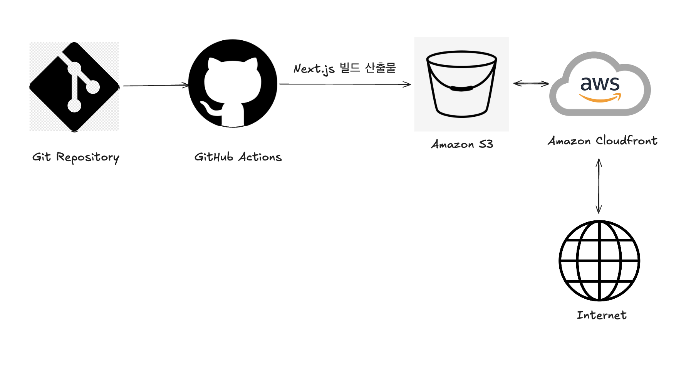

# 프론트엔드 CI/CD 파이프라인

## 개요

### Next.js 애플리케이션을 AWS를 이용해 자동으로 빌드하고 배포하는 과정

1. 개발자가 Git Repository에 코드를 푸시
2. GitHub Actions가 트리거되어 Next.js 애플리케이션을 빌드
3. 빌드된 산출물이 Amazon S3에 업로드 됨
4. Amazon CloudFront가 S3의 콘텐츠를 전 세계적으로 캐싱 및 배포
5. 최종 사용자는 인터넷을 통해 애플리케이션에 접근

## 주요 링크

- S3 버킷 웹사이트 엔드포인트: http://soojin-bucket-list.s3-website-ap-southeast-2.amazonaws.com
- CloudFrount 배포 도메인 이름: https://d2fwzsqtl4gzqo.cloudfront.net

## 주요 개념

### GitHub Actions

GitHub Actions는 GitHub에서 제공하는 CI/CD 도구로, 리포지토리 내에서 자동화된 워크플로우를 설정하고 실행할 수 있도록 도와줍니다.

- 워크플로우: 자동화된 작업의 집합으로, 특정 이벤트(예: 코드 푸시, PR 생성 등)가 발생했을 때 실행됩니다.
- 잡(Jobs): 워크플로우 내에서 실행되는 개별 작업 단위입니다. 여러 개의 잡을 병렬 또는 순차적으로 실행할 수 있습니다.
- 액션(Actions): 잡을 구성하는 개별 작업 단위로, 사전에 정의된 스크립트나 커스텀 스크립트를 실행할 수 있습니다.
- 런너(Runners): 잡을 실제로 실행하는 환경입니다. GitHub에서 호스팅하거나 셀프 호스팅이 가능합니다.

### CI/CD 도구

CI/CD 도구는 Continuous Integration(지속적 통합)과 Continuous Deployment/Delivery(지속적 배포/전달) 프로세스를 자동화합니다.

- 지속적 통합 (CI, Continuous Integration): 개발자들이 코드 변경을 빈번하게 병합하고 자동으로 테스트하는 프로세스입니다. 이를 통해 코드 변경 시점마다 코드가 잘 통합되는지 확인할 수 있습니다.
- 빌드(Build): 소스 코드를 컴파일하고 필요한 종속성을 설치합니다.
- 테스트(Test): 코드의 기능을 검증하는 자동화된 테스트를 실행합니다.
- 지속적 배포 (CD, Continuous Deployment): 통합된 코드가 자동으로 프로덕션 환경에 배포되는 프로세스입니다. 모든 단계가 자동화되어 사용자의 개입 없이도 배포가 가능합니다.
- 지속적 전달 (CD, Continuous Delivery): 배포 프로세스가 자동화되어 있지만, 최종 배포는 사람이 승인한 후에 이루어지는 방식입니다.

### Amazon S3

Amazon S3(Simple Storage Service)는 Amazon Web Services(AWS)에서 제공하는 객체 스토리지 서비스입니다. S3는 인터넷을 통해 언제든지 어디서나 데이터를 저장하고 검색할 수 있는 매우 확장 가능하고 내구성이 뛰어난 스토리지 솔루션입니다.

- 버킷(Bucket): 데이터를 저장하는 컨테이너입니다. 각 버킷은 고유한 이름을 가져야 하며, 버킷 안에 객체를 저장합니다.
- 객체(Object): S3에 저장되는 개별 파일이나 데이터 단위입니다. 객체는 고유의 키(Key)와 메타데이터로 식별됩니다.
- 키(Key): 객체를 식별하는 고유한 문자열입니다. 버킷 내에서 객체는 키로 구분됩니다.
- 메타데이터(Metadata): 객체와 관련된 데이터로, 파일 유형, 생성 시간 등의 정보를 포함합니다.

### 스토리지(Storage)

스토리지는 데이터를 저장하고 관리하기 위한 기술과 장치들을 의미합니다. 다양한 유형의 스토리지가 있으며, 각기 다른 용도와 특징을 가지고 있습니다.

주요 스토리지 유형:

- 블록 스토리지(Block Storage)
- 파일 스토리지(File Storage)
- 객체 스토리지(Object Storage)

주요 스토리지 개념:

- RAID(Redundant Array of Independent Disks): 여러 디스크를 결합하여 데이터 중복성을 제공하고 성능을 향상시키는 기술입니다.
- SSD(Solid State Drive): 플래시 메모리를 사용한 저장 장치로, HDD에 비해 빠른 속도와 낮은 지연 시간을 제공합니다.
- HDD(Hard Disk Drive): 자기 디스크를 사용하는 저장 장치로, 대용량 데이터를 저렴하게 저장할 수 있습니다.

### Amazon CloudFront

Amazon CloudFront는 AWS에서 제공하는 콘텐츠 전송 네트워크(Content Delivery Network, CDN) 서비스입니다. CloudFront는 웹 콘텐츠, 비디오, 애플리케이션 데이터 등의 정적 및 동적 콘텐츠를 사용자에게 빠르고 안전하게 제공할 수 있도록 도와줍니다.

주요 특징:

- 저지연성 및 높은 전송 속도: 전 세계에 분산된 엣지 로케이션(Edge Location)을 통해 콘텐츠를 사용자에게 빠르게 전달합니다.
- 보안: AWS Shield, AWS WAF(Web Application Firewall) 등의 보안 서비스와 통합되어 DDoS 공격, 악의적 트래픽 등을 방어합니다.
- 확장성: 트래픽 증가에 따라 자동으로 확장하여 높은 가용성을 제공합니다.
- 유연성: 동적 콘텐츠와 정적 콘텐츠 모두를 효율적으로 전달할 수 있으며, 다양한 사용자 지정 옵션을 제공합니다.
- 비용 효율성: 사용한 만큼만 비용을 지불하는 구조로, 트래픽 양과 데이터 전송량에 따라 비용이 발생합니다.

### 콘텐츠 전송 네트워크(CDN)

CDN은 지리적으로 분산된 서버 네트워크로, 사용자에게 웹 콘텐츠를 빠르게 전달하기 위해 설계된 시스템입니다.

주요 개념:

- 엣지 서버(Edge Server): CDN 네트워크 내에 분산된 서버로, 사용자의 요청을 가장 가까운 위치에서 처리하여 지연 시간을 최소화합니다.
- 오리진 서버(Origin Server): 원본 콘텐츠가 저장된 서버로, 엣지 서버가 요청한 콘텐츠를 제공하는 역할을 합니다.
- 캐싱(Caching): 자주 요청되는 콘텐츠를 엣지 서버에 저장하여, 오리진 서버에 대한 요청을 줄이고 콘텐츠 전송 속도를 높입니다.
- 지역 로드 밸런싱(Geographic Load Balancing): 사용자 위치에 따라 가장 가까운 엣지 서버로 트래픽을 분산시켜, 최적의 성능을 제공합니다.

### 캐시 무효화(Cache Invalidation)

캐시 무효화(Cache Invalidation)는 캐시에 저장된 데이터가 변경되었거나 더 이상 유효하지 않을 때, 이를 제거하거나 갱신하여 최신 데이터로 교체하는 과정을 의미합니다. 캐시 무효화는 데이터 일관성을 유지하고 최신 정보를 제공하기 위해 필수적인 작업입니다.

Amazon CloudFront에서의 캐시 무효화:

Amazon CloudFront는 특정 객체를 무효화할 수 있는 기능을 제공합니다. 이를 통해 캐시된 콘텐츠를 최신 상태로 유지할 수 있습니다.

- Invalidation API: CloudFront에서 제공하는 API를 사용하여 특정 경로나 객체를 무효화할 수 있습니다.
- 관리 콘솔: AWS 관리 콘솔을 통해 무효화 요청을 제출할 수 있습니다.

### Repository Secret과 환경변수

Repository Secret

Repository Secret은 GitHub와 같은 버전 관리 시스템에서 민감한 정보를 안전하게 저장하고 사용하는 방법을 제공합니다. 주로 API 키, 데이터베이스 비밀번호, 토큰과 같은 민감한 데이터를 저장합니다.

특징 및 사용법:

- 보안성: Repository Secret은 암호화되어 저장되며, GitHub Actions 워크플로우에서만 사용할 수 있습니다.
- 사용법: GitHub 리포지토리 설정에서 Secrets 섹션을 통해 추가할 수 있습니다.
  - 예를 들어, GitHub Actions에서 secrets.MY_SECRET 형식으로 사용합니다.
- 제한: 리포지토리 수준에서 정의되므로, 해당 리포지토리 내에서만 접근할 수 있습니다. 조직(Organization) 수준에서 설정할 수도 있습니다.

환경변수 (Environment Variables)

환경변수는 소프트웨어 실행 환경에서 설정할 수 있는 변수로, 프로그램 실행 시 동적으로 값을 전달하는 데 사용됩니다.

특징 및 사용법:

- 범용성: 환경변수는 운영 체제, 애플리케이션, 스크립트 등 다양한 수준에서 사용됩니다.
- 설정 위치:
  - 로컬 머신: .bashrc, .zshrc 등의 파일에서 환경변수를 설정할 수 있습니다.
  - CI/CD 파이프라인: GitHub Actions, Jenkins 등에서 환경변수를 설정하고 사용할 수 있습니다.
- 안전성: 민감한 데이터를 환경변수로 다룰 경우, 이를 노출하지 않도록 주의해야 합니다. Repository Secret과 함께 사용하면 보안성을 높일 수 있습니다.
